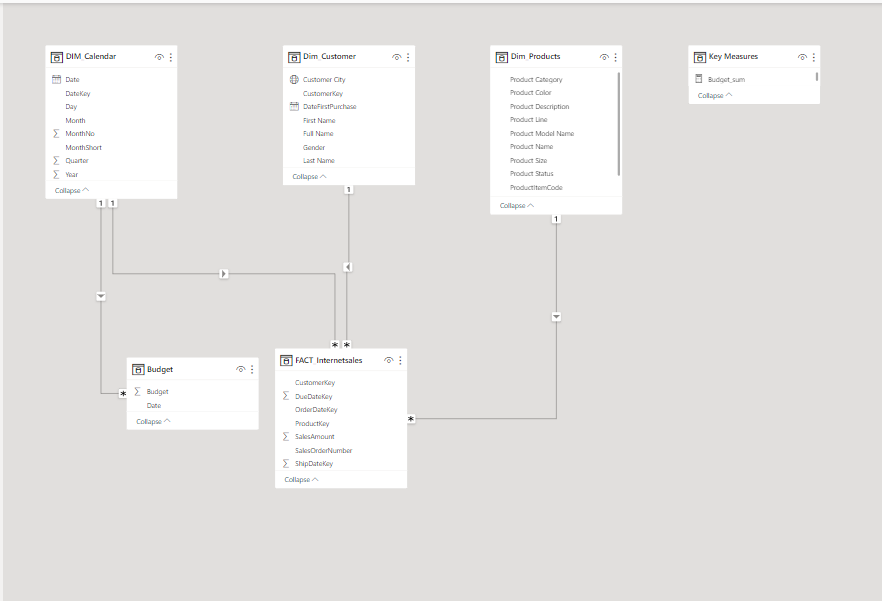

# Dataproject
## Sales Analysis

### Business Request and User Stories
##### The business request for this project was an executive sales report for the sales manager. Based on the request that was made from the business the following user stories were defined to fulfill delivery and ensure that the acceptance criteria were maintained throughout the project.

### Data Cleansing & Transformation (SQL)
##### To create the necessary data model for doing analysis and fulfilling the business needs defined in the user stories, the following tables were extracted using SQL. 
##### An additional data source (sales budgets) was provided in Excel format and was connected to the data model in PowerBi.

##### Below are the SQL statements for cleansing and transforming the necessary data. (Click on each like to view the SQL statements)
##### [Dim_Customers](https://github.com/stephighodalo/Dataproject/blob/main/Dim_Customer.sql)
##### [Dim_Calendar](https://github.com/stephighodalo/Dataproject/blob/main/Dim_Calendar.sql)
##### [Dim_Products](https://github.com/stephighodalo/Dataproject/blob/main/Dim_Products.sql)
##### [FactInternetsales](https://github.com/stephighodalo/Dataproject/blob/main/FACT_Internetsales.sql)

### Data Model
##### The image below is the data model after the cleansed and prepared tables were read into Power BI.
##### This data model also shows how Budget table has been connected to FACT_Internetsales and other necessary dimension tables.

### Sales Management Dashboard
##### The completed sales management dashboard comprises three key pages:

##### **Sales Overview**: This serves as the central hub, offering a comprehensive view of sales performance.

##### **Customer Details**: This page combines tables and visualizations to provide detailed information on customer-related data, allowing for a thorough analysis of sales over time.

##### **Product Details**: Similarly, this page combines tables and visualizations to present in-depth product-related data, facilitating a comprehensive examination of sales over time.

##### Download the PowerBi file [here](https://github.com/stephighodalo/Dataproject/blob/main/Sales%20Analysis%20-%20Adventure%20works.pbix)
